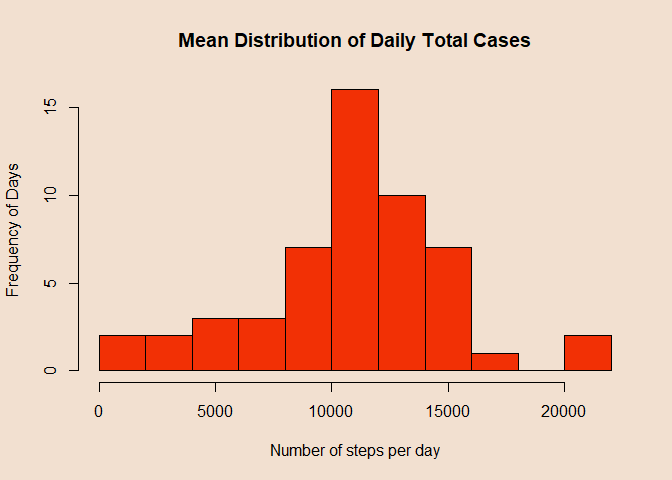
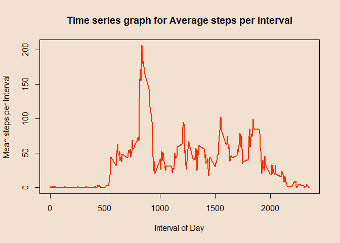
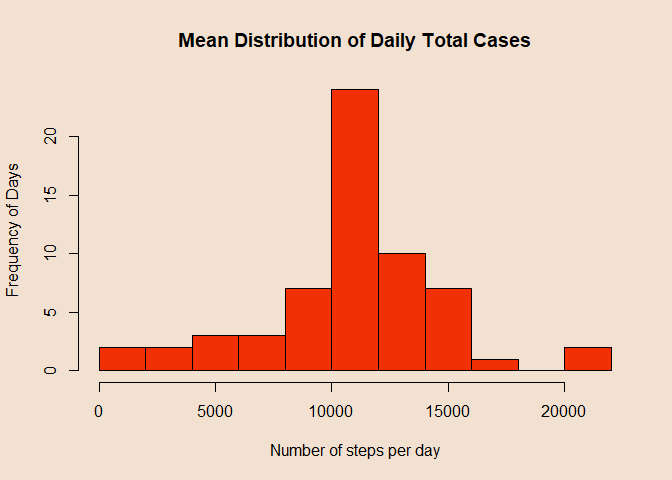
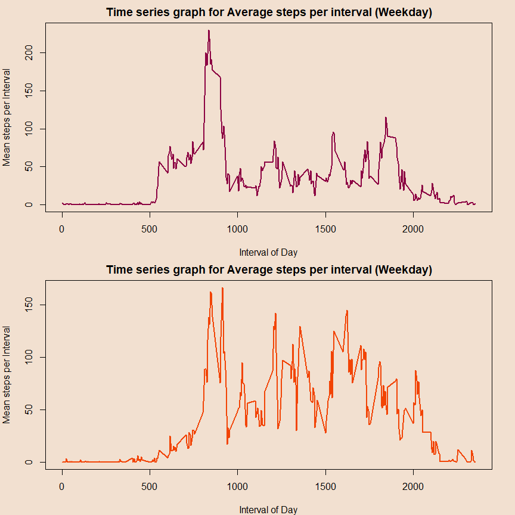

## Loading and preprocessing the data


```r
activity <- read.csv("activity.csv")
dim(activity)
```

```
## [1] 17568     3
```

```r
head(activity)
```

```
##   steps       date interval
## 1    NA 2012-10-01        0
## 2    NA 2012-10-01        5
## 3    NA 2012-10-01       10
## 4    NA 2012-10-01       15
## 5    NA 2012-10-01       20
## 6    NA 2012-10-01       25
```

## What is mean total number of steps taken per day?


```r
par(bg='#F2E0D0')
meanx <- aggregate(steps ~ date, activity, sum)
hist(meanx$steps, breaks=15, xlab="Number of steps per day", ylab = "Frequency of Days",
     main="Mean Distribution of Daily Total Cases",col="#F23005")
```

<!-- -->

```r
meanxmean <- mean(meanx$steps)
meanxmedian <- median(meanx$steps)
```
Here, mean is **1.0766189\times 10^{4} (i.e 10766.19)** and median is **10765 (i.e. 10765)**.

## What is the average daily activity pattern?


```r
par(bg='#F2E0D0')
meany <- aggregate(steps ~ interval, activity,mean)
plot(meany$interval,meany$steps,type = "l",col="#F23005",lwd=2,xlab = "Interval of Day", ylab = "Mean steps per Interval",main = "Time series graph for Average steps per interval")
```

<!-- -->

the 5-minute interval, on average across all the days in the dataset, which contains the maximum number of steps:


```r
maxinterval <- meany$interval[which.max(meany$steps)]
meany$interval[which.max(meany$steps)]
```

```
## [1] 835
```

Interval numbered **835** has maximum average steps across all the days. 

## Imputing missing values

Count the total number of missing values in the dataset(or Rows)


```r
missing<-is.na(activity[,1])
sum(missing)
```

```
## [1] 2304
```
We can see we have **2304** missing values.
we will use mean of intervals from previous figure to fill that interval's NA Values (or Impute the NA Values).


```r
par(bg='#F2E0D0')
newactivity <- activity
for(x in 1:17568) {
       if(is.na(newactivity[x, 1])==TRUE) {
       newactivity[x, 1] <- meany[meany$interval %in% newactivity[x, 3], 2]}}
newmeanx <- aggregate(steps ~ date, newactivity, sum)
hist(newmeanx$steps, breaks=15, xlab="Number of steps per day", ylab = "Frequency of Days",
     main="Mean Distribution of Daily Total Cases",col="#F23005")
```

<!-- -->

```r
newmeanxmean <- mean(newmeanx$steps)
mean(newmeanx$steps)
```

```
## [1] 10766.19
```

```r
newmeanxmedian <- median(newmeanx$steps)
median(newmeanx$steps)
```

```
## [1] 10766.19
```
Here, mean is **1.0766189\times 10^{4} (i.e 10766.19)** and median is **1.0766189\times 10^{4} (i.e. 10766.19)**.

**As both the new and old Datasets are similar and NA values are imputed by mean per interval. MEAN for both the dataset remained same. whereas median for new dataset increased to 10766.19 from 10765.**

## Are there differences in activity patterns between weekdays and weekends?


```r
newactivity$date <- as.Date(newactivity$date)
newactivity$weekdays <- factor(ifelse(weekdays(newactivity$date) %in% c("Saturday", "Sunday"),"weekend","weekday"))

weekdayx <- newactivity[newactivity$weekday=="weekday", ]
weekendx <- newactivity[newactivity$weekday=="weekend", ]

meanweekday <- aggregate(steps ~ interval, weekdayx,mean)
meanweekend <- aggregate(steps ~ interval, weekendx, mean)

par(mfrow=c(2, 1), mar=c(4, 4, 2, 2),bg='#F2E0D0')
plot(meanweekday$interval,meanweekday$steps,type = "l",col="#8C0343",lwd=2,xlab = "Interval of Day", ylab = "Mean steps per Interval",main = "Time series graph for Average steps per interval (Weekday)")
plot(meanweekend$interval,meanweekend$steps,type = "l",col="#F24405",lwd=2,xlab = "Interval of Day", ylab = "Mean steps per Interval",main = "Time series graph for Average steps per interval (Weekday)")
```

<!-- -->
